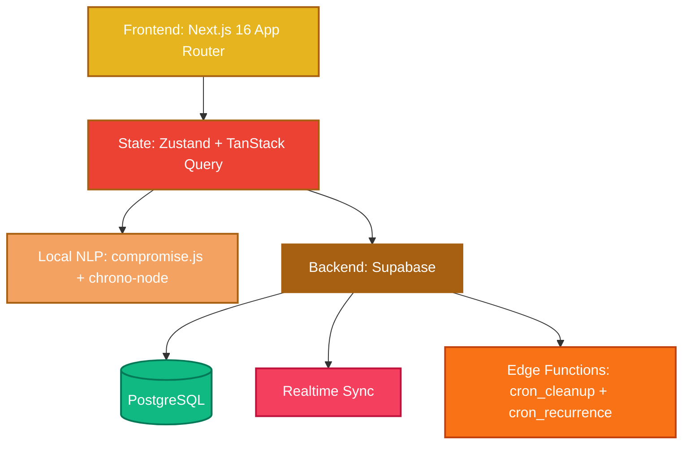

<div align="center">
  

  <h1 align="center">Presense</h1>

  <p align="center">
    <strong>A second brain that refuses to be another infinite canvas.</strong>
  </p>

  <p align="center">
    An open-source personal operating system for anyone — student to professional — that captures fast, decides deliberately, and reviews regularly. Atmospheric, calm, and installable as a PWA.
  </p>

  <p align="center">
    <a href="https://github.com/mzaman001/Presense/blob/main/LICENSE">
      
    </a>
    <a href="https://github.com/mzaman001/Presense/stargazers">
      
    </a>
    <a href="https://github.com/mzaman001/Presense/network/members">
      
    </a>
  </p>
</div>

---

## The Philosophy

Most productivity apps give you an infinite canvas. You end up spending hours building systems instead of doing the work. **Presense is the opposite — it *is* the system.**

Your mind is for having ideas, not holding them. Presense provides four distinct spaces, zero configuration, and a bespoke glassmorphic UI that feels like a warm lamp in a dark room. It captures tasks, people, thoughts, and memories via local NLP (zero cloud cost, zero data exposure), routes them to the right space, and surfaces them back at the right moment. It is deliberately personal — a student capturing an essay deadline, a professional tracking a meeting, or anyone with a busy mind emptying their head before bed. Not multi-tenant SaaS, not a team tool, not a developer-only tool.

### The Four Spaces

The app has four primary spaces, each with a distinct warm-family identity color derived from the current theme's accent hue (per OKLCH color theory — see `docs/project/DESIGN_SYSTEM.md` §1.5):

| Space | Identity color | Focus | Description |
| :---: | :---: | :--- | :--- |
|  | Amber gold | **Action** | Tasks with implementation intentions. Not a checklist — a commitment engine. Board / Today / Calendar views. |
|  | Coral red | **Ideation** | Threaded thoughts that resurface. Daily notes, journals, ideas — all in continuous threads. |
|  | Sandy orange | **Connection** | Lightweight personal CRM + "where did I put it" inventory. Know who you met, what you discussed, and where things are. |
|  | Deep amber | **Curiosity** | Curated reading queue. Auto-archives after 30 days — engage or let go. |

Plus an **Inbox** for un-routed captures, a **Home** dashboard, and a global **Trash** with 30-day soft-delete recovery.

---

## Signature Features

- **Natural Language Capture** — Hit `Cmd+K` anywhere. Type *"Meet Sarah about the design at 2pm tomorrow"*. Local NLP (compromise.js + chrono-node) extracts the date, person, and context automatically with zero API costs and zero cloud data exposure. All parsing happens client-side via `src/lib/capture-router.ts`.
- **Three Full Themes × 2 Modes** — Warm (default, amber/coral on near-black), Navy (deep blue), Forest (deep green) — each in dark and light. 6 combinations, more than any non-Notion competitor. Applied via `data-theme` + `data-mode` attributes on `<html>`.
- **Deep-Focus Pomodoro** — Immersive fullscreen focus mode with SVG progress rings, configurable intervals, and ambient backgrounds. Distractions vanish; only the task remains.
- **Smart Routing & Context** — Inbox items route to any space with one click. Recurring patterns, deadlines, and relationships are detected from your natural language inputs.
- **Realtime Sync** — Every list, count, and status updates instantly across all spaces via Supabase Realtime. Ref-counted shared channels with 5-second teardown debounce. No refreshes. No stale data.
- **Soft-Delete + 30-Day Global Trash** — Edge Functions (`cron_cleanup`, `cron_recurrence`) enforce a 30-day retention window across all 5 entity types (items, people, threads, explores, locations). Recover from `/trash` within 30 days, or let it auto-purge. Centralized in `src/lib/item-lifecycle.ts`.
- **Bespoke Glassmorphic UI** — Atmospheric backgrounds with floating amber/coral orbs, translucent glass surfaces, warm accents, and fluid micro-interactions. A premium design that feels alive and highly responsive. Glassmorphism 2.0 spec in `docs/project/DESIGN_SYSTEM.md` §3.
- **PWA + Offline Support** — Full PWA capabilities with Serwist service worker caching. Installable on iOS/Android home screens. Works offline with fallback page at `/~offline`. `UpdatePrompt` component notifies when a new version is ready.
- **Smooth Scrolling** — Lenis-powered smooth scrolling, app-wide via `LenisProvider.tsx`.
- **Ambient Orbs** — Floating amber/coral orbs that create the atmospheric "warm lamp in a dark room" feel, themed per theme (warm/navy/forest each have their own orb palette).
- **Connection Status** — Real-time connection indicator with 3 states (connected / reconnecting / disconnected) via `ConnectionStatus` component.

---

## Quick Start

### Prerequisites
- **Node.js** 18.18+ or 20+ (Next.js 16 requirement)
- **Supabase** project ([free tier](https://supabase.com/pricing) works)
- **npm** (project uses `package-lock.json`; Husky + lint-staged pre-commit hook configured for npm)

### Setup Environment

```bash
# 1. Clone the repository
git clone https://github.com/mzaman001/Presense.git
cd Presense

# 2. Install dependencies
npm install

# 3. Configure environment variables
cp .env.example .env.local
```

Edit `.env.local` with your Supabase credentials:
```env
NEXT_PUBLIC_SUPABASE_URL=your_supabase_project_url
NEXT_PUBLIC_SUPABASE_ANON_KEY=your_supabase_anon_key
SUPABASE_SERVICE_ROLE_KEY=your_supabase_service_role_key  # server-only, for auth.admin.deleteUser
UPSTASH_REDIS_REST_URL=your_upstash_url                   # optional in dev, required for rate limiting in prod
UPSTASH_REDIS_REST_TOKEN=your_upstash_token               # optional in dev
```

### Initialize Database & Run

```bash
# 1. Link your Supabase project (one-time)
npx supabase link --project-id your_project_id

# 2. Push the database schema (25 migrations)
npx supabase db push

# 3. Generate TypeScript types from your Supabase schema
npm run types:generate

# 4. Start the development server
npm run dev
```

Your second brain is now alive at [http://localhost:3000](http://localhost:3000).

### Available Scripts

| Script | What it does |
|---|---|
| `npm run dev` | Start Next.js dev server (Turbopack) |
| `npm run build` | Production build |
| `npm run start` | Start production server |
| `npm run lint` | Run ESLint |
| `npm test` | Run Vitest (144 tests) |
| `npm run test:watch` | Vitest in watch mode |
| `npm run test:coverage` | Vitest with coverage report |
| `npm run types:generate` | Regenerate `src/types/database.types.ts` from Supabase schema |
| `npm run types:check` | Regenerate types + fail if drift detected (runs in `prebuild`) |
| `npm run script:clean` | Run `scripts/clean-threads.js` (clean up stale threads) |
| `npm run script:snooze` | Run `scripts/check_snooze.js` (check snoozed tasks) |

**Pre-commit hook** (Husky + lint-staged) runs ESLint `--fix` + Prettier `--write` + `tsc --noEmit` on staged files. **CI** runs lint + typecheck + test + build + 7 security scans (osv-scanner, semgrep, sonarcloud, sonarqube, trivy, eslint, ci).

---

## Architecture & Tech Stack

Presense is built on a modern, bleeding-edge stack optimized for speed, aesthetics, and developer experience.



| Layer | Technology | Why we chose it |
|:---|:---|:---|
| **Framework** | [Next.js 16.2.9](https://nextjs.org/) (App Router) | Server Components, Turbopack, `proxy.ts` (Next 16's renamed middleware) for CSP nonce + auth + cookie forwarding |
| **Language** | [TypeScript 5.x](https://www.typescriptlang.org/) (strict) | Type safety; generated Supabase types in `src/types/database.types.ts` (733 lines, `prebuild` regenerates + fails on drift) |
| **Runtime** | React 19.2.4 / React DOM 19.2.4 | Latest stable React |
| **Styling** | [Tailwind CSS 4.x](https://tailwindcss.com/) | `@theme inline` mapping, custom glassmorphism design tokens, `tw-animate-css` |
| **Animation** | [Framer Motion 12.40](https://www.framer.com/motion/) | `m.*` + `LazyMotion features={domMax} strict` for tree-shaking; `MotionConfig reducedMotion="user"` for a11y |
| **Smooth Scroll** | [Lenis 1.3.25](https://github.com/studio-freight/lenis) | App-wide smooth scrolling via `LenisProvider.tsx` |
| **State (client)** | [Zustand 5.0.14](https://zustand-demo.pmnd.rs/) | Lightweight, boilerplate-free global state (`useAppStore.ts`, 116 lines) |
| **State (server)** | [TanStack Query 5.101](https://tanstack.com/query) | Server state with `refetchOnWindowFocus: false` (avoids fighting Realtime) |
| **Backend** | [Supabase 2.108](https://supabase.com/) | Postgres (11 tables, 25 migrations), Auth (Google OAuth + magic link), Realtime (ref-counted shared channels), Edge Functions (`cron_cleanup` 30-day hard-delete, `cron_recurrence` recurring task generation) |
| **NLP** | [compromise.js 14.15](https://github.com/spencermountain/compromise) + [chrono-node 2.9](https://github.com/wanasit/chrono-node) | Fast, local entity extraction + date parsing with zero API costs or privacy concerns. All in `src/lib/capture-router.ts` (313 lines) |
| **Forms** | [React Hook Form 7.81](https://react-hook-form.com/) + [@hookform/resolvers 5.4](https://github.com/react-hook-form/resolvers) | Type-safe form state; Zod schema integration |
| **Validation** | [Zod 4.4.3](https://zod.dev/) | Schema validation for forms, env vars, API routes |
| **URL State** | [nuqs 2.9](https://nuqs.47ng.com/) | Shareable, bookmarkable view/filter state |
| **PWA** | [Serwist 9.5.11](https://serwist.pages.dev/) (`@serwist/next` + `serwist`) | Service worker caching, offline fallback, installable |
| **Icons** | [Lucide React 1.17](https://lucide.dev/) | Single icon library, 38 files import it; `Icon.tsx` wrapper standardizes `strokeWidth={1.5}` |
| **UI Positioning** | [@floating-ui/react 0.27](https://floating-ui.com/) | `FloatingPortal` + `useFloating` with `flip`/`shift` middleware for Dropdown/Popover (BUG-03/27 resolved) |
| **Toasts** | [sonner 2.0](https://sonner.emilkowal.ski/) | Toast notifications via `ToastProvider.tsx` |
| **Drag-and-Drop** | [@dnd-kit 6.x/10.x](https://dndkit.com/) | Do Board columns, People reorder |
| **Env Validation** | [@t3-oss/env-nextjs 0.13](https://env.t3.gg/) | Type-safe env access with `.catch()` wrapper (never throws — invariant #1) |
| **Logging** | [Pino 10.3](https://github.com/pinojs/pino) | Structured server logs (transport still a stub — error *reporting* now covered by Sentry instead, see next row) |
| **Error Tracking** | [Sentry 10.70](https://sentry.io/) (`@sentry/nextjs`) | DSN-gated client/server/edge capture; `/api/telemetry` forwards web-vitals + client errors; API-route 500s captured; CSP `report-uri` (OBS-01, Aug 2026) |
| **Rate Limiting** | [Upstash Redis + Ratelimit](https://upstash.com/) | `/api/capture` endpoint rate limiting |
| **Testing** | [Vitest 4.1](https://vitest.dev/) + [Playwright 1.61](https://playwright.dev/) | 144 unit/integration tests pass; 2 Playwright E2E specs |

---

## The Design System

> *Presense feels like a warm lamp in a dark room.*

Four pillars shape every design decision in Presense:

1. **Atmosphere over flatness** — Every background has ambient light from orbs, every card has surface shimmer. The app exists in an environment, never on a blank canvas.
2. **Warmth at the centre** — Amber, coral, deep orange. Cool tones (navy, forest) are alternate **full themes** a user opts into, not accents layered onto the warm theme. Per-space colors are derived in OKLCH from each theme's own accent hue, so all four spaces stay within the theme's color family.
3. **Glass as the language of depth** — Cards, panels, modals, dropdowns, toasts are glass surfaces — but glass is a tool for hierarchy, not decoration on every element. Glassmorphism 2.0 spec (alpha-gradient fills, grain layer, specular border) in `docs/project/DESIGN_SYSTEM.md` §3.
4. **Inter carries the voice** — All type is Inter. JetBrains Mono only for numbers/timestamps. (Note: `Geist` font is also loaded but conflicts with Inter for `--font-sans` — see `docs/project/DOCS_NEEDS_CODE.md` for removal.)

### Theme System

Presense ships with **3 full themes × 2 modes = 6 combinations**:

| Theme | `--bg-base` (dark) | `--accent` (dark) | Light mode status |
|---|---|---|---|
| **Warm** (default) | `#0F0A00` (near-black warm) | `#E5B41E` (amber) | ⚠ Known bug: warm-light has unreadable text (white on cream) — see `docs/project/DOCS_NEEDS_CODE.md` |
| **Navy** | `#04091A` (deep blue-black) | `#7692FF` (periwinkle) | ✓ Correct |
| **Forest** | `#080D06` (deep forest) | `#EFDD8D` (warm yellow) | ✓ Correct |

Themes are applied via `data-theme` + `data-mode` attributes on `<html>`. `src/lib/theme.ts` normalizer maps 3 generations of legacy names (`wahala`/`orange`/`blue`/`forest` → `sunset`/`midnight`/`meadow` → `warm`/`navy`/`forest`). See `docs/project/CONTEXT.md` for full theme history.

---

## Project Structure

```text
Presense-main/
├── .github/workflows/          # 8 CI workflows (ci, eslint, osv-scanner, semgrep, sonarcloud, sonarqube, trivy)
├── .husky/pre-commit           # Husky pre-commit hook (eslint --fix + prettier --write + tsc --noEmit)
├── docs/
│   ├── agents/EXECUTION_RULES.md       # The contract for AI coding agents (7 iron laws, STOP LIST)
│   ├── plans/EXECUTION_SPEC.md          # 1755-line active backlog (23 sections + audit cross-ref)
│   └── project/
│       ├── ARCHITECTURE.md              # System architecture, data model, folder layout
│       ├── COMPONENT_MANIFEST.md        # Approved UI primitives dictionary
│       ├── CONTEXT.md                   # What Presense is (product truth)
│       ├── DESIGN_SYSTEM.md             # Visual spec (color, type, glass, motion, surfaces)
│       └── DOCS_NEEDS_CODE.md           # Doc-identified issues requiring code fixes
├── public/                      # icons (icon.svg, icon-192.png, icon-512.png), manifest.json
├── scripts/                     # 6 ad-hoc scripts (2 referenced, 4 dead)
├── src/
│   ├── app/                     # Next 16 App Router — 21 routes
│   │   ├── (app)/               # Authenticated spaces (do, think, remember, explore, inbox, trash, home)
│   │   ├── (auth)/login/        # Glassmorphic login flow
│   │   ├── onboarding/          # 5-step first-run wizard
│   │   ├── api/                 # 4 route handlers (account, capture, people/reorder, telemetry)
│   │   ├── auth/callback/       # OAuth code exchange
│   │   ├── ~offline/            # PWA offline fallback
│   │   ├── layout.tsx           # Root layout (theme init script, fonts)
│   │   ├── global-error.tsx     # Root error boundary
│   │   ├── sw.ts                # Serwist service worker
│   │   └── globals.css          # 41 KB — all CSS custom properties, 6 theme×mode blocks
│   ├── components/
│   │   ├── features/            # 11 domain components (incl. 4 calendar)
│   │   ├── layout/              # 12 layout components (Navigation, AmbientBackground, etc.)
│   │   ├── providers/           # RealtimeProvider (ref-counted shared channels)
│   │   └── ui/                  # 28 reusable primitives (GlassCard, Avatar, Skeleton, etc.)
│   ├── hooks/                   # 9 custom React hooks (useRealtime, useReducedMotion, useHaptics, etc.)
│   ├── lib/                     # 15 utility modules + __tests__/ (capture-router, theme, env, item-lifecycle, etc.)
│   ├── store/                   # Zustand state (useAppStore.ts)
│   ├── types/                   # database.types.ts (generated), calendar.ts
│   ├── instrumentation-client.ts # Global error handlers
│   └── proxy.ts                 # Next 16 middleware (proxy, not middleware) — CSP nonce, auth, cookie forwarding
├── supabase/
│   ├── functions/               # 2 Edge Functions (cron_cleanup, cron_recurrence)
│   └── migrations/              # 25 SQL migrations (dual naming: 001_-009_ then timestamped)
├── tests/                       # 2 Playwright E2E specs (sanity, realtime)
├── AGENTS.md                    # Single entry point for AI coding agents
├── GEMINI.md                    # One-line pointer to AGENTS.md (Antigravity resolution)
└── README.md                    # This file
```

---

## Status

Presense is in active development. The audit (July 9, 2026) identified 8 root patterns of issues, all tracked in `docs/plans/EXECUTION_SPEC.md` and `docs/project/DOCS_NEEDS_CODE.md`:

- **P0 (Critical):** 37 of 71 Supabase mutations don't check `error` (silent data loss risk — BUG-38); warm-light theme has unreadable text (ROOT PATTERN 2).
- **P1 (High):** 7 mobile `h-screen` bugs; `Sheet.tsx` drag swallows nested taps; 99 hardcoded hex break theming; design system fragmentation.
- **P2 (Strategic):** No calendar integration, no native apps, no AI features, no command palette, no weekly review.

See `docs/plans/EXECUTION_SPEC.md` §24 for the full 46-item P0/P1/P2 roadmap with 10 quick wins. See `docs/project/DOCS_NEEDS_CODE.md` for the code-fix backlog.

---

## Contributing

We welcome contributions to make Presense even better! Before starting, read `AGENTS.md` (the single entry point for coding agents) and `docs/agents/EXECUTION_RULES.md` (the contract — 7 iron laws, STOP LIST).

1. **Fork** the repository.
2. **Read** `AGENTS.md` and `docs/agents/EXECUTION_RULES.md` fully before touching any code.
3. **Pick** exactly ONE unblocked ticket from `docs/plans/EXECUTION_SPEC.md`.
4. **Create** a feature branch: `git checkout -b fix/BUG-XX-short-description`
5. **Implement** only the change described in the ticket. Do not batch tickets.
6. **Build + test:** `npm run build && npm test` after every change.
7. **Commit** with conventional format: `fix: BUG-XX short description` (max 60 chars, include ticket ID).
8. **Push** to the branch: `git push origin fix/BUG-XX-short-description`
9. **Open** a Pull Request. Include `Invariant-change-approved-by: <name/date>` in the PR description if touching any of the 7 hard invariants in `AGENTS.md` §1.

For major architectural changes, please open an issue first to discuss what you would like to change.

---

## License

Distributed under the **MIT License**. See [`LICENSE`](LICENSE) for more information.

---

<div align="center">
  <br />
  <p><em>"Your mind is for having ideas, not holding them."</em></p>
  <h3>Presense — Built with purpose.</h3>
</div>
