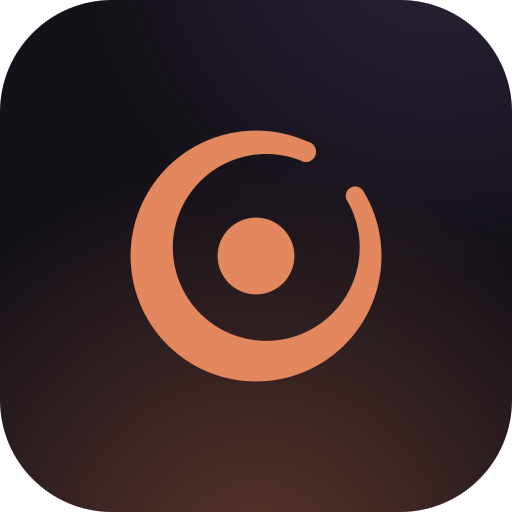
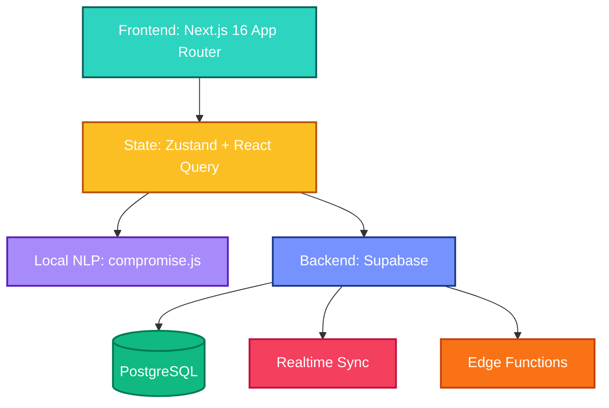

<div align="center">
  

  <h1 align="center">Presense</h1>

  <p align="center">
    <strong>A second brain that refuses to be another infinite canvas.</strong>
  </p>

  <p align="center">
    Built on cognitive science principles to keep you executing, not organizing.<br/>Presense is an intelligent, atmospheric, and highly-performant personal operating system.
  </p>

  <p align="center">
    <a href="https://github.com/mzaman001/Presense/blob/main/LICENSE">
      
    </a>
    <a href="https://github.com/mzaman001/Presense/stargazers">
      
    </a>
    <a href="https://github.com/mzaman001/Presense/network/members">
      
    </a>
  </p>
</div>

---

## 🌌 The Philosophy

Most productivity apps give you an infinite canvas. You end up spending hours building systems instead of doing the work. **Presense is the opposite — it *is* the system.**

We believe that your mind is for having ideas, not holding them. Presense provides four distinct spaces, zero configuration, and a bespoke glassmorphic UI that feels like a warm lamp in a dark room. 

### The Four Spaces

| Space | Focus | Description |
| :---: | :--- | :--- |
|  | **Action** | Tasks with implementation intentions. Not a checklist — a commitment engine. |
|  | **Ideation** | Threaded thoughts that resurface. Daily notes, journals, ideas — all in continuous threads. |
|  | **Connection** | Lightweight personal CRM. Know who you met, what you discussed, and what's next. |
|  | **Curiosity** | Curated reading queue. Auto-archives after 30 days — engage or let go. |

---

## ✨ Signature Features

- 🧠 **Natural Language Capture** — Hit `Cmd+K` anywhere. Type *"Meet Sarah about the design at 2pm tomorrow"*. Local NLP extracts the date, person, and context automatically with zero API costs.
- 🧘‍♂️ **Deep-Focus Pomodoro** — Immersive fullscreen focus mode with SVG progress rings, configurable intervals, and ambient backgrounds. Distractions vanish; only the task remains.
- 🪄 **Smart Routing & Context** — Inbox items route to any space with one click. Recurring patterns, deadlines, and relationships are detected from your natural language inputs.
- ⚡ **Realtime Sync** — Every list, count, and status updates instantly across all spaces via Supabase Realtime. No refreshes. No stale data. Performance polished.
- 🧹 **Aggressive Cleanup** — Edge Functions enforce a 30-day soft-delete cycle on explores and old tasks. Your workspace stays pristine automatically.
- 🎨 **Bespoke Glassmorphic UI** — Atmospheric backgrounds, translucent glass surfaces, warm amber accents, and fluid micro-interactions. A premium design that feels alive and highly responsive.

---

## 🚀 Quick Start

### Prerequisites
- **Node.js** 18+
- **Supabase** project ([free tier](https://supabase.com/pricing) works)
- **npm**, **yarn**, or **pnpm**

### Setup Environment

```bash
# 1. Clone the repository
git clone https://github.com/mzaman001/Presense.git
cd Presense

# 2. Install dependencies
npm install

# 3. Configure environment variables
cp .env.example .env.local
```

Edit `.env.local` with your Supabase credentials:
```env
NEXT_PUBLIC_SUPABASE_URL=your_supabase_project_url
NEXT_PUBLIC_SUPABASE_ANON_KEY=your_supabase_anon_key
```

### Initialize Database & Run

```bash
# 1. Set up the database schema
npx supabase db push

# 2. Start the development server
npm run dev
```

Your second brain is now alive at [http://localhost:3000](http://localhost:3000).

---

## 🏗️ Architecture & Tech Stack

Presense is built on a modern, bleeding-edge stack optimized for speed, aesthetics, and developer experience.



| Layer | Technology | Why we chose it |
|:---|:---|:---|
| **Framework** | [Next.js 16](https://nextjs.org/) | Server Components, Turbopack, App Router for optimal performance. |
| **Language** | [TypeScript](https://www.typescriptlang.org/) | Type safety and fantastic developer experience. |
| **Styling** | [Tailwind CSS 4](https://tailwindcss.com/) | Rapid UI iteration with our custom glassmorphism design tokens. |
| **Animation** | [Framer Motion](https://www.framer.com/motion/) | Fluid micro-interactions and layout transitions. |
| **State** | [Zustand](https://zustand-demo.pmnd.rs/) | Lightweight, boilerplate-free global state. |
| **Backend** | [Supabase](https://supabase.com/) | Postgres, Auth, Realtime, and Edge Functions in one unified platform. |
| **NLP** | [compromise.js](https://github.com/spencermountain/compromise) | Fast, local entity extraction with zero API costs or privacy concerns. |

---

## 🎨 The Design System

> *Presense feels like a warm lamp in a dark room.*

Four pillars shape every design decision in Presense:

1. **Atmosphere over flatness** — Every background has ambient light, every card has surface shimmer. The app exists in an environment, never on a blank canvas.
2. **Warmth at the centre** — Amber, coral, deep orange. Cool colours appear only as secondary accents. The default experience is warm.
3. **Glass as the language of depth** — Cards, panels, modals, toasts — everything is a glass surface floating in the atmospheric background.
4. **Inter carries the voice** — Confident where it matters, restrained where it supports. No font mixing except *JetBrains Mono* for numeric data.

---

## 📁 Project Structure

```text
src/
├── app/                  # Next.js App Router (Server & Client Components)
│   ├── (app)/            # Authenticated spaces (Do, Think, Explore, Remember)
│   ├── (auth)/           # Beautiful glassmorphic login flow
│   ├── api/              # Route handlers
│   └── onboarding/       # First-run wizard experience
├── components/
│   ├── features/         # Domain components (TaskCard, SearchModal, etc.)
│   ├── layout/           # App Shell (Sidebar, Navigation, AmbientBackground)
│   └── ui/               # Reusable Primitives (GlassCard, Avatar, Skeleton)
├── hooks/                # Custom React hooks (useRealtime, useDialogFocus)
├── lib/                  # Utilities, Supabase client, NLP router logic
└── store/                # Zustand state slices
supabase/
├── functions/            # Edge Functions (auto-cleanup, background jobs)
└── migrations/           # SQL schema migrations
```

---

## 🤝 Contributing

We welcome contributions to make Presense even better!

1. **Fork** the repository.
2. **Create** a feature branch: `git checkout -b feature/your-amazing-feature`
3. **Commit** your changes: `git commit -m 'feat: add amazing feature'`
4. **Push** to the branch: `git push origin feature/your-amazing-feature`
5. **Open** a Pull Request.

For major architectural changes, please open an issue first to discuss what you would like to change.

---

## 📜 License

Distributed under the **MIT License**. See [`LICENSE`](LICENSE) for more information.

---

<div align="center">
  <br />
  <p><em>"Your mind is for having ideas, not holding them."</em></p>
  <h3>Presense — Built with purpose.</h3>
</div>
