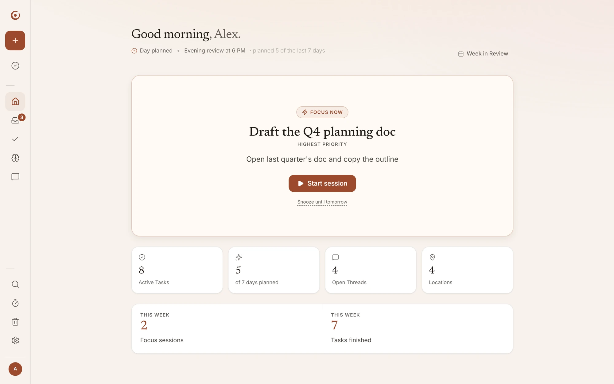
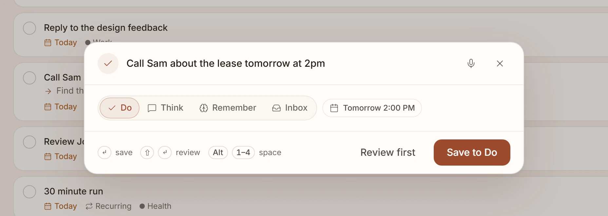
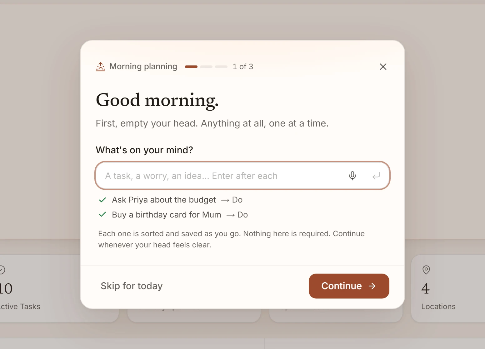
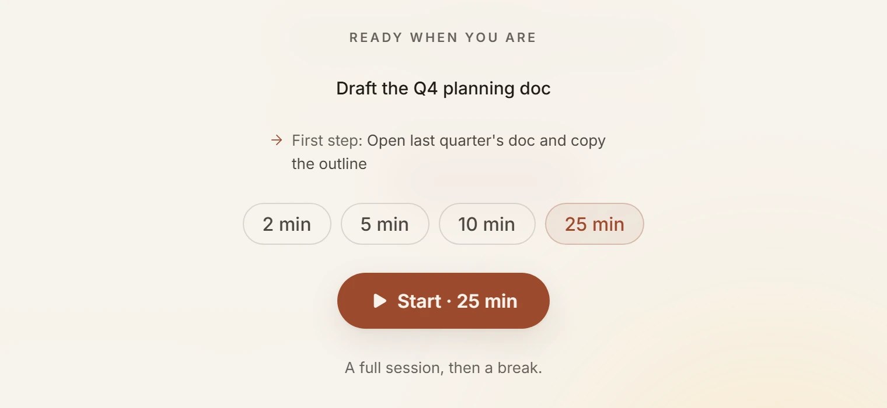

<div align="center">
  
  <h1>Presense</h1>
  <p><b>Empty your head, pick what fits, and actually start.</b></p>
  <p>
    <a href="https://presense-kohl.vercel.app/">Try it</a> ·
    <a href="https://github.com/mzaman001/Presense/issues">Report a bug</a> ·
    <a href="AGENTS.md">Contribute</a>
  </p>
</div>

<br />

<p align="center">
  <picture>
    <source media="(prefers-color-scheme: dark)" srcset="docs/assets/home-dark.webp" />
    
  </picture>
</p>

Most task apps are good at storing things and bad at the moment that matters: starting. Presense is a calm, personal planner built around three steps — get everything out of your head, choose a day that actually fits in the hours you have, and begin the next thing without ceremony.

## Capture

Type the way you think. *"Call Sam about the lease tomorrow at 2pm"* becomes a task due tomorrow at 2 PM. Dates, repeats and where you put things are picked up as you type, in your browser, never sent to an AI service. Captures survive a dropped connection, and you can speak them or send them from any app's share sheet.

<p align="center">
  <picture>
    <source media="(prefers-color-scheme: dark)" srcset="docs/assets/capture-dark.webp" />
    
  </picture>
</p>

## Plan

A morning and evening ritual walks you through what's on your mind, what's left over, and what to carry, reschedule, or let go. Your day is measured against the hours you actually have, unfinished work rolls over without guilt, and there are no streaks to break.

<p align="center">
  <picture>
    <source media="(prefers-color-scheme: dark)" srcset="docs/assets/ritual-dark.webp" />
    
  </picture>
</p>

## Start

Start any task to see just that task and its first step, nothing else. Set a 2, 5 or 10 minute timer, or a full focus session, only if you want one. When something keeps getting put off, Presense quietly asks *"What's in the way?"* — no nagging notifications.

<p align="center">
  <picture>
    <source media="(prefers-color-scheme: dark)" srcset="docs/assets/focus-dark.webp" />
    
  </picture>
</p>

## Also

- **Think** — running threads of notes for ideas that aren't tasks yet.
- **Remember** — places worth keeping track of.
- **Everywhere** — installs as an app, works offline, and syncs live across devices.
- **Forgiving** — everything deleted sits in the trash for 30 days.
- **Light and dark** — a warm sunrise and a plum sunset.

## Keyboard

| Key | Action |
|---|---|
| <kbd>C</kbd> or <kbd>N</kbd> | Capture |
| <kbd>Ctrl</kbd> <kbd>K</kbd> or <kbd>/</kbd> | Search |
| <kbd>1</kbd> <kbd>2</kbd> <kbd>3</kbd> <kbd>4</kbd> | Inbox, Do, Remember, Think |
| <kbd>6</kbd> | Home |

## Run it yourself

You need Node.js 20+ and a free [Supabase](https://supabase.com) project.

```bash
git clone https://github.com/mzaman001/Presense.git
cd Presense
npm install
cp .env.example .env.local        # add your Supabase URL and anon key
npx supabase link --project-ref <your-project-ref>
npx supabase db push
npm run dev                       # http://localhost:3000
```

For production, deploy the `cron_cleanup` and `cron_recurrence` edge functions and schedule them in the Supabase dashboard. They empty the trash and bring recurring tasks back.

## Built with

[Next.js](https://nextjs.org) · [React](https://react.dev) · [Supabase](https://supabase.com) · [Tailwind CSS](https://tailwindcss.com) · [TanStack Query](https://tanstack.com/query) · [chrono-node](https://github.com/wanasit/chrono) · [Serwist](https://serwist.pages.dev)

Want to contribute? [`AGENTS.md`](AGENTS.md) covers the architecture, the rules, and the checks every change must pass.

## License

[MIT](LICENSE)
